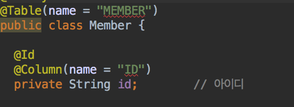
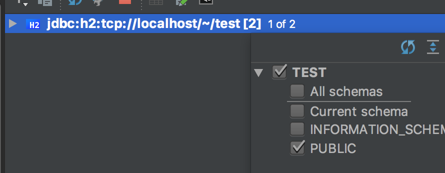

## JPA Cannot resolve table error
- JPA 책을 따라하다가 아래 같은 에러를 만났다.
- JPA Version은 `4.3.10.Final`이였다.

위 그림 처럼 `cannot resolve table`, `cannot resolve column`이라는 에러가 발생할 경우

## 해결방법

`위와 같이 datasource`에서 `PUBLIC`이 선택되어 있어야 한다.